# Enterprise AI Agents: Snowflake Cortex × AWS Strands Agents
## Hands-On Workshop — AWS Tech Summit 2026

**Duration:** 2 hours | **Audience:** AWS Solution Architects | **Format:** Pair labs

---

## Overview

**Cortex Agents** orchestrate across both structured and unstructured data sources to deliver insights. They plan tasks, use tools to execute these tasks, and generate responses. Agents use Cortex Analyst (structured) and Cortex Search (unstructured) as tools, along with LLMs, to analyze data. Cortex Search extracts insights from unstructured sources, while Cortex Analyst generates SQL to process structured data. A comprehensive support for tool identification and tool execution enables delivery of sophisticated applications grounded in enterprise data.

The **Snowflake-managed MCP server** lets AI agents securely retrieve data from Snowflake accounts without needing to deploy separate infrastructure. You can configure the MCP server to serve Cortex Analyst and Cortex Search as tools on the standards-based interface. MCP clients discover and invoke these tools, and retrieve data required for the application. With managed MCP servers on Snowflake, you can build scalable enterprise-grade applications while maintaining access and privacy controls.

**AWS Strands Agents** is an open-source SDK that takes a model-first approach to building AI agents. With Strands you define an agent by giving it a model, a set of tools, and a prompt — then the SDK handles the agentic loop, tool execution, and context management. Strands works with any foundation model on Amazon Bedrock and supports standard tool protocols including MCP, making it ideal for connecting to Snowflake's managed MCP servers.

---

## What You'll Build

By the end of this workshop, you will have deployed a production-style AI agent that:

1. Answers **quantitative business questions** ("What is revenue by region this quarter?") by generating and executing SQL against a Snowflake **Semantic View** via **Cortex Analyst**

2. Answers **qualitative questions** ("What are customers saying about delivery?") via **Cortex Search** over unstructured review and ticket data

3. Orchestrates both capabilities through the **Snowflake Managed MCP Server**, exposed to an **AWS Strands Agent** running on EC2 with **Amazon Bedrock** (Claude Sonnet 4.6) as the LLM inference layer

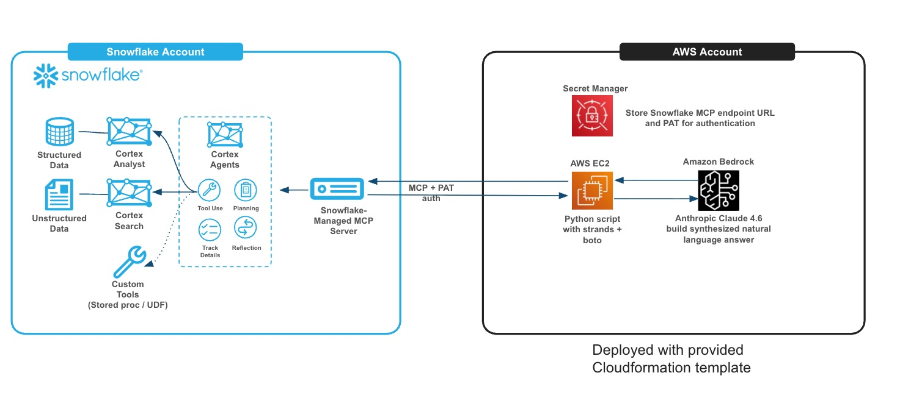

---

## Scenario: RetailIQ

RetailIQ is an Italian multi-channel retailer with 50 stores across Italy plus an online shop. The data covers:

- **50,000 orders** across 3 years (2022–2024)

- **5,000 customers** with loyalty tiers and regional data

- **200 products** across 5 categories

- **50 stores** across Italian regions

- **15,000 customer reviews** (for Cortex Search)

- **8,000 support tickets** (for Cortex Search)

---

## Prerequisites

**Snowflake:**

- A Snowflake account with Cortex features enabled (Cortex Search, Cortex Analyst, MCP Server)

- ACCOUNTADMIN access (or an admin who can run `01_setup_environment.sql`)

**AWS:**

- AWS account with access to Amazon Bedrock

- A Claude Sonnet model subscribed in AWS Marketplace

- IAM permissions to deploy CloudFormation stacks and create Secrets Manager secrets

**Local (facilitator only):**

- Python 3.9+ with pandas, numpy, faker (`pip install pandas numpy faker`)

- To generate the dataset: `python 00_data/generate_data.py`

---

## Workshop Modules

| Module | Topic | Time | File |
|--------|-------|------|------|
| 0 | Architecture overview & setup | 15 min | `01_snowflake_setup/01_setup_environment.sql` |
| 1 | Load data & explore the schema | 10 min | `01_snowflake_setup/02_create_tables.sql` + `03_load_data.sql` |
| 2 | Build & tune a Semantic View | 25 min | `02_semantic_view/retailiq_semantic_view.yaml` |
| 3 | Cortex Search services | 10 min | `01_snowflake_setup/04_create_search_service.sql` |
| 4 | Cortex Agent (native, in CoWork) | 15 min | `01_snowflake_setup/05_create_cortex_agent.sql` |
| 5 | MCP Server + PAT Token | 10 min | `03_aws_setup/01_create_mcp_server.sql` |
| 6 | AWS Strands Agent setup | 15 min | `03_aws_setup/agentcore_cfn.yaml` |
| 7 | Strands agent — end-to-end | 10 min | `03_aws_setup/retailiq_agent.py` |
| 8 | Multi-turn demo + production patterns | 10 min | — |

---

## Step-by-Step Instructions

### Getting Started — Create a Workspace from the Workshop GitHub Repo

**What is a Snowflake Workspace?**

A Workspace is a collaborative coding environment inside Snowsight where you can work with SQL files, notebooks, Streamlit apps, and dbt projects — all versioned and organized in folders. Workspaces can be connected to a Git repository, which means all the workshop files will be automatically available inside Snowflake without any manual uploads.

For this workshop, we'll create a **Git Workspace** linked to the public GitHub repo containing all the SQL scripts, data, and configuration files.

**Step 1 — Open the Projects menu**

1. In Snowsight, click **Projects** in the left navigation sidebar

2. Select **Workspaces** from the submenu


**Step 2 — Create a new Git Workspace**

1. Click the **"+"** button next to the search icon in the top toolbar

2. In the dropdown, under **"Create new"**, select **"Git workspace"**


**Step 3 — Configure the Git repository connection**

The "Create workspace from Git repository" dialog opens. Fill in the fields as follows:

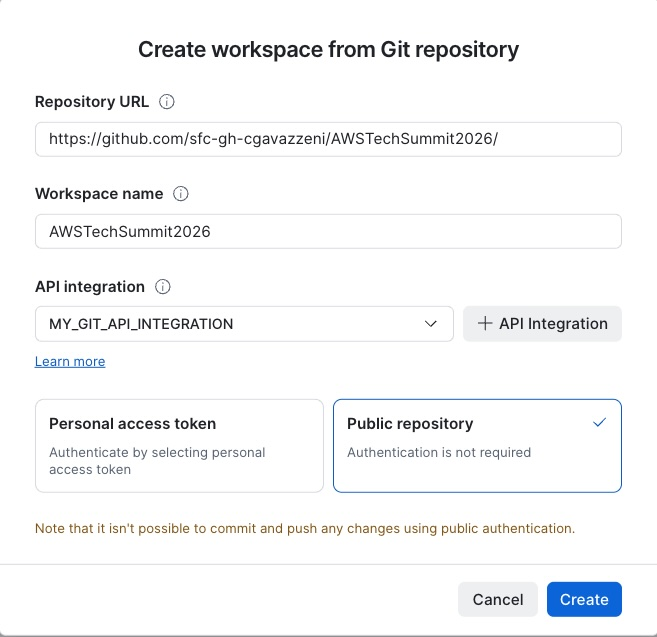

- **Repository URL**: enter `https://github.com/sfc-gh-cgavazzeni/AWSTechSummit2026/`

- **Workspace name**: enter `AWSTechSummit2026` (or any name you prefer)

- **API integration**: If you already have a Git API integration, select it from the dropdown. If not, click the **"+ API Integration"** button to create one directly from this dialog — no SQL required. Give it a name (e.g., `MY_GIT_API_INTEGRATION`) and Snowflake will create it for you.

- **Authentication**: select **"Public repository"** (no authentication needed — the repo is public)

- Click **"Create"**

> **Note:** Since we use "Public repository" authentication, the workspace is read-only (you can't push changes back). This is fine for the workshop — you'll run SQL files directly from the workspace.

**Step 4 — Explore the workspace**

After creation, you'll see the full workshop file tree in the left panel:

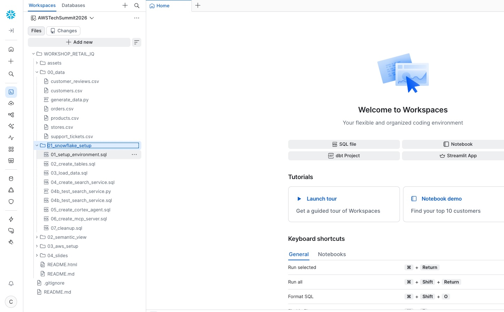

You can now open any SQL file directly from the workspace (it opens as a SQL worksheet), run it, and navigate between files. All workshop modules are organized in numbered folders:

- `00_data/` — synthetic dataset and generator

- `01_snowflake_setup/` — all SQL scripts (modules 0–5 + cleanup)

- `02_semantic_view/` — Semantic View DDL

- `03_aws_setup/` — CloudFormation + Strands agent

- `04_slides/` — presentation deck

---

### Module 0 — Environment Setup `[15 min]`

> Run as **ACCOUNTADMIN**

In your workspace, navigate to `WORKSHOP_RETAIL_IQ > 01_snowflake_setup` and click on **`01_setup_environment.sql`** to open it. Run it top to bottom.

> **Important:** The script includes a `BEGIN...END` block that grants `RETAILIQ_ROLE` to your current user. If you're running statements one at a time (⌘+Enter), make sure to **select the entire BEGIN...END block** (all 4 lines) before executing. If you skip this, the Analyst UI will show "You do not have access to the role RETAILIQ_ROLE" later.

This creates:

- Role `RETAILIQ_ROLE` and user `retailiq_user`

- Warehouse `RETAILIQ_WH` (XSmall, auto-suspend 60s)

- Database `RETAILIQ_DB` and schema `ANALYTICS`

- Stage `RETAILIQ_STG` for data loading

> **Presenter tip:** While this runs, explain the Snowflake object hierarchy to the audience.

**Step — Download CSV files locally (ONLY IF YOU DIDN'T CLONE THE GIT ALSO LOCALLY)**

> **Note:** If you have already cloned the Git repository to your local laptop, you already have the CSV files in the `00_data/` folder and can skip this download step.

Before uploading data to the stage, you need to download all CSV files from the workspace to your local laptop. This is the easiest code-free way to get data into Snowflake.

In the workspace file tree (left panel), expand the `00_data` folder. For each CSV file, click the **⋯** (three dots) menu next to the file name and select **Download**:


Download all 6 CSV files:
- `customers.csv`
- `customer_reviews.csv`
- `orders.csv`
- `products.csv`
- `stores.csv`
- `support_tickets.csv`

Save them to a known folder on your laptop (e.g., `Downloads/retailiq_data/`). You will upload them to the Snowflake stage in the next module.

---

### Module 1 — Load Data `[10 min]`

**Step 1:** Upload the CSV files to the Snowflake stage.

1. In the left sidebar, click **Catalog** → select **Database Explorer** from the dropdown menu. You'll see both the workspace file tree (with all CSV files visible) and the Catalog navigation:

   

2. In the Database Explorer, navigate to **RETAILIQ_DB → ANALYTICS → Stages** and click on **RETAILIQ_STG**:

   

3. Clicking on **RETAILIQ_STG** opens the stage detail page. You'll see the stage metadata (Internal Stage, owner RETAILIQ_ROLE) and tabs for Stage Files, Stage Details, and Lineage. Click the **+ Files** button in the top-right corner:

   

4. The **Upload Your Files** dialog appears. Verify that Schema is set to `RETAILIQ_DB.ANALYTICS` and Stage is `RETAILIQ_STG`. Drag and drop all 6 CSV files from your local folder (or click **Browse** to select them), then click **Upload**:

   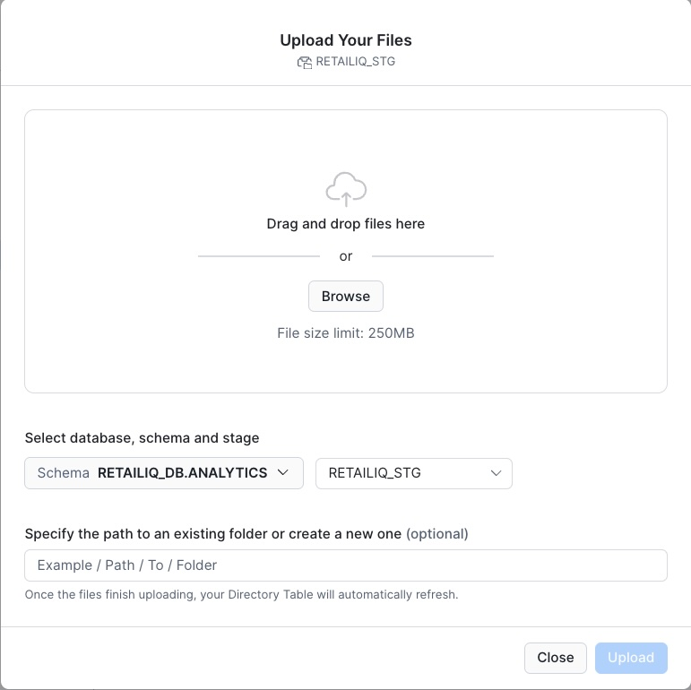

Upload these files from the `00_data/` folder:

- `orders.csv`

- `products.csv`

- `customers.csv`

- `stores.csv`

- `customer_reviews.csv`

- `support_tickets.csv`

> **Navigate back to the workspace:** Click **Projects → Workspaces** in the left sidebar and open your **AWSTechSummit2026** workspace to access the SQL files.

**Step 2:** Run `01_snowflake_setup/02_create_tables.sql` to create tables.

**Step 3:** Run `01_snowflake_setup/03_load_data.sql` to load data.

Expected row counts after loading:
```
orders:           ~50,000
products:            ~200
customers:         ~5,000
stores:               ~50
customer_reviews: ~15,000
support_tickets:   ~8,000
```

---

### Module 2 — Semantic View: Build & Tune `[25 min]`

> The most important module. Take your time here.

#### What is a Semantic View?

A Semantic View is a **business vocabulary layer** that sits between your raw tables and Cortex Analyst. It defines:

- How tables **join** to each other

- What **dimensions** and **metrics** mean in business terms

- **Synonyms** so the AI understands "revenue", "fatturato", "sales" all mean the same thing

- **Verified Queries** — pre-validated SQL for your most important KPIs

**The key insight for SA architects:** *A Semantic View gives you full control over the vocabulary and logic the AI uses. The difference between a bare auto-generated SV and a tuned one with verified queries is the difference between a demo and a production deployment.*

#### Step 2a — Build a Basic Semantic View with Cortex Code (10 min)

Cortex Analyst always requires a Semantic View. You can build one in several ways: manually selecting tables, joins, and metrics from scratch in the UI; importing an existing dashboard from **Power BI**, **Tableau**, or any compatible **Open Semantic Interchange (OSI)** file; or using AI assistance. In this workshop, we'll use **Cortex Code** (CoCo) and its **semantic-view skill** to scaffold a first version automatically from the schema.

**Open Cortex Code** — after running `03_load_data.sql` and verifying your row counts, look at the bottom-right corner of the Snowsight workspace. You'll see the **"Open or move CoCo"** button (the blue/green sparkle icon). Click it to open the CoCo chat panel.

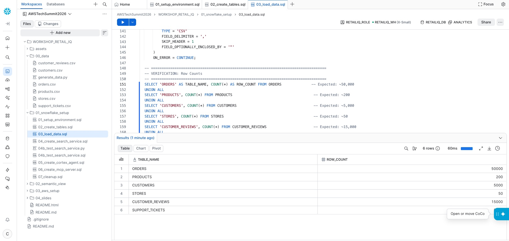


Once the CoCo chat panel opens, type the following prompt:

```
Create a semantic view called RETAILIQ_SV_BASIC for the tables
RETAILIQ_DB.ANALYTICS.ORDERS, RETAILIQ_DB.ANALYTICS.PRODUCTS,
RETAILIQ_DB.ANALYTICS.CUSTOMERS, and RETAILIQ_DB.ANALYTICS.STORES.

Keep it simple: just define the tables, detect the join relationships,
and add basic column descriptions. No verified queries, no custom metrics,
no synonyms — just the foundation.
```

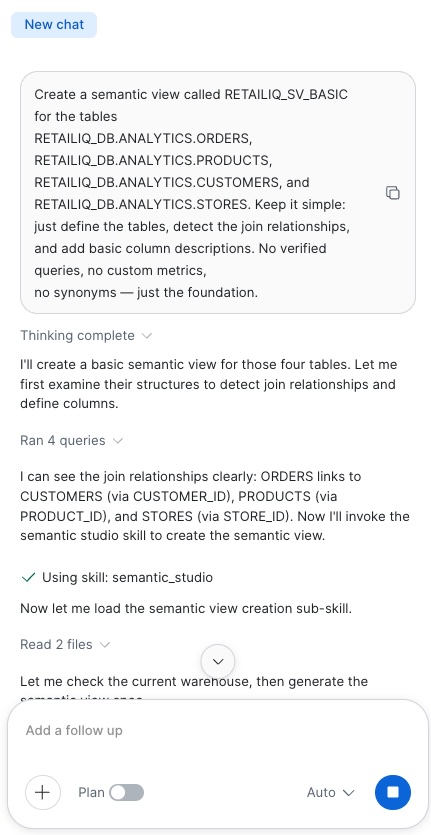

*CoCo receives the prompt and starts working. It first examines the four table schemas (running queries to detect columns and types), then identifies the join relationships: ORDERS links to CUSTOMERS (via CUSTOMER_ID), PRODUCTS (via PRODUCT_ID), and STORES (via STORE_ID). It then invokes the `semantic_studio` skill to generate the complete Semantic View definition.*

**Watch CoCo work** — it will:

1. Run queries to inspect all 4 table schemas

2. Detect 3 join relationships (ORDERS→CUSTOMERS, ORDERS→PRODUCTS, ORDERS→STORES)

3. Invoke the **semantic_studio** skill to generate the SV YAML

4. Read and verify the generated file

5. Add any missing join relationships

6. Deploy the Semantic View to Snowflake

When CoCo finishes generating the Semantic View, it will prompt you to **save it to Snowflake**. You'll see a confirmation dialog: "Save semantic view from cortex_project/RETAILIQ_... to RETAILIQ_DB.ANALYTICS" — click **Allow** to deploy it. After deployment, CoCo shows "Changed 1 file" — click **Keep all** to confirm.

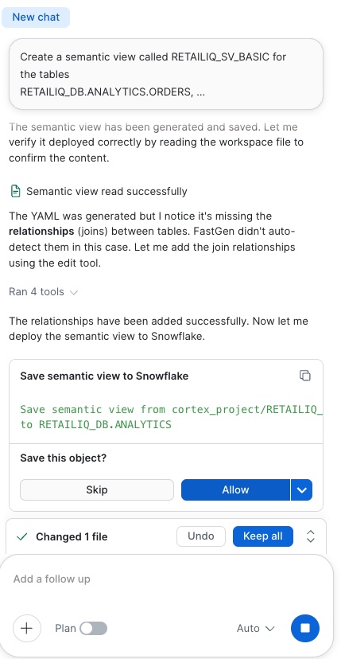

*CoCo completes the generation, adds relationships, and presents the "Save semantic view to Snowflake" action. Click **Allow** to deploy, then **Keep all** to confirm the changes.*

**Now test the basic SV in Cortex Analyst Playground:**

1. In Snowsight, click the **AI & ML** icon (brain icon) in the left navigation sidebar

2. Select **Cortex Analyst** from the menu

3. You'll see a list of available Semantic Views — click on **RETAILIQ_SV_BASIC** (the one CoCo just created)

   On the left panel of the Semantic View editor, you can view and edit the different components of the SV: **Tables**, **Relationships**, **Facts**, **Dimensions**, and **Metrics**. Notice how CoCo automatically recognized join keys between tables, identified numeric columns as potential facts/metrics, and categorized text/date columns as dimensions. This is a solid starting point, but it can be further improved by adding business-specific metric definitions, synonyms, filters, and verified queries — which is exactly what we'll do in Step 2b.

4. Click the **Playground** tab at the top to open the interactive chat interface

5. In the chat box at the bottom, type and send:

> "What is the revenue by region for this year?"

Observe the gap: the basic SV has no concept of "revenue" as a metric (it doesn't know to filter `status='Completed'`), "region" is ambiguous (customer region? store region?), and there are no synonyms or verified queries. The generated SQL may be wrong or imprecise.


#### Step 2a-bis — Understand How Cortex Analyst Processes a Question (5 min)

Now that we have a basic SV, let's use it to understand **how Analyst works under the hood**. In the Playground, ask a question that the basic SV can handle reasonably well:

> "What is the total revenue by channel year to date?"

When Analyst returns the answer, click on the **SQL** panel to expand it. You'll see two distinct query representations:

**1. Logical Query** — This is the *semantic-level* plan that Analyst generates first. It describes WHAT to compute using the vocabulary defined in your Semantic View (metric names, dimension names, filters). Think of it as the "intent" expressed in business terms:

- Which metric to compute (e.g., `total_amount`)

- Which dimension to group by (e.g., `channel`)

- Which filters to apply (e.g., time range)

**2. Physical Query** — This is the actual executable Snowflake SQL that gets run against your warehouse. It translates the logical plan into concrete JOINs, column references, and WHERE clauses. This is what you'd have to write manually without Analyst.

**3. The "+ Verified Query" button** — Notice the **+ Verified Query** button (or similar "Save as VQ" action) that appears alongside the generated SQL. This is the fast path for tuning: if the generated SQL is correct, you can save it directly as a Verified Query so that next time this question (or a similar one) is asked, Analyst uses your validated SQL as-is. This is the iterative tuning loop:

1. Ask a question → Analyst generates SQL

2. Verify the SQL is correct

3. Click "+ Verified Query" to lock it in

4. Next time, Analyst matches the question pattern and reuses the exact validated SQL

**4. Response metadata** — Expand the response metadata panel (click the info icon or "Details" in the response). This shows a JSON object like:

```json
{
  "question_category": "CLEAR_SQL",
  "analyst_orchestration_path": "regular_sqlgen",
  "cortex_search_retrieval": [],
  "analyst_latency_ms": 4284,
  "model_names": ["claude-sonnet-4-6"],
  "is_semantic_sql": false
}
```

Key fields to highlight:

- **question_category** — How Analyst classified the question (e.g., `CLEAR_SQL` means it was clear enough to generate SQL directly)

- **analyst_orchestration_path** — The internal routing used (`regular_sqlgen` = standard SQL generation, vs. VQ match when a Verified Query is used)

- **model_names** — Which LLM model was used for generation

- **analyst_latency_ms** — End-to-end latency in milliseconds (useful for performance monitoring)

- **cortex_search_retrieval** — Whether any Cortex Search services were invoked (empty array = none)

- **is_semantic_sql** — Whether the SQL was generated using the semantic layer

> **Purpose of metadata for production teams:** Response metadata enables monitoring and observability in production deployments. You can track: (a) which orchestration path is being used (VQ match vs. regular SQL generation), (b) which questions are classified as unclear and need VQs, (c) latency per question for SLA monitoring, (d) which models are being used. This is how you build a tuning roadmap — focus VQ effort on the highest-volume questions that take the `regular_sqlgen` path.

#### Step 2b — Deploy the Tuned Semantic View via SQL (10 min)

Now let's replace the basic SV with the hand-crafted one that has metrics, synonyms, and verified queries.

1. Go back to your **Workspace** in Snowsight (click the workspace name in the left sidebar or the **Workspaces** tab at the top)

2. In the file explorer, navigate to `WORKSHOP_RETAIL_IQ > 02_semantic_view` and click on **`create_semantic_view.sql`** to open it directly — the file is already in your workspace from the Git repo

4. Run the entire script — it executes a single `CREATE OR REPLACE SEMANTIC VIEW` DDL statement that defines all tables, relationships, dimensions, facts, metrics, custom instructions, and verified queries in one go.


5. Verify the SV was created:

```sql
SHOW SEMANTIC VIEWS LIKE 'RETAILIQ_SV' IN SCHEMA RETAILIQ_DB.ANALYTICS;
```

#### Step 2c — Test with the Tuned Semantic View (5 min)

Go back to **AI & ML → Cortex Analyst** in the left navigation sidebar. This time, select **RETAILIQ_SV** (the tuned version you just deployed).

Since this Semantic View is owned by `RETAILIQ_ROLE` and you're currently using `ACCOUNTADMIN`, you'll see a "Semantic View Access" dialog. Select **"Switch to role RETAILIQ_ROLE"** and click **Switch role** — this switches your session to the role that owns the SV, giving you full edit access.

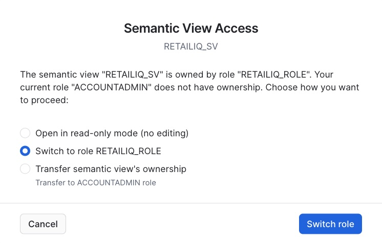

Before opening the Playground, take a moment to look at the **left panel** — notice how much richer this Semantic View is compared to the basic one CoCo generated: you'll see custom **Metrics** (like `total_revenue`, `avg_order_value`), explicit **Relationships** with join conditions, business-specific **Dimensions** with synonyms, **Verified Queries** that serve as ground-truth examples, and **Custom Instructions** under the AI SQL Generation section that guide the model on how to interpret ambiguous terms, handle edge cases, and apply business logic (e.g., "revenue always means completed orders only", "when the user says 'region' default to customer region"). This is the difference between an auto-scaffolded SV and a production-tuned one.

Now open the **Playground** tab and type:

> "What is the revenue by region for this year?"

Compare the results with what you got from the basic SV:

- The SQL now correctly uses `SUM(total_amount) WHERE status='Completed'`

- "Region" resolves unambiguously to `customers.region`

- Synonyms mean "fatturato", "revenue", "sales" all work

#### Step 2d — Verified Queries (informational)

Verified Queries are the single most impactful tuning mechanism for Cortex Analyst. They allow you to lock in the exact SQL for your most important business questions — so next time Analyst sees a matching question pattern, it uses your validated SQL as-is instead of generating from scratch.

Here's an example of what the "Add Verified Queries" screen looks like:

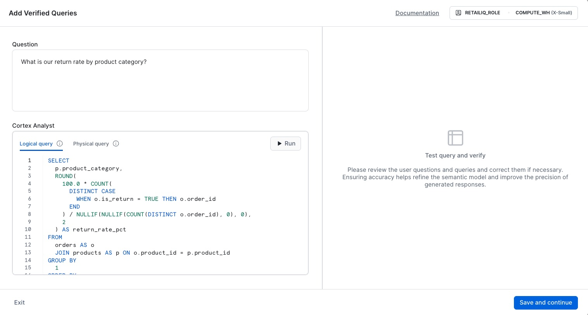

*You enter a natural language question, write the correct SQL (logical query), test it on the right panel, then click "Save and continue" to persist it as ground-truth. In production, start with auto-generated SQL, validate it, then iteratively add VQs for your highest-volume questions.*

> **Note:** Have a look at the suggestions proposed by Cortex Analyst — it will recommend additional metrics and dimensions to add to the semantic view (e.g. customer lifetime value, cohort analysis, etc.). In a real project you would iteratively enrich your SV based on these suggestions. For today's workshop, we don't need to complete all of them — our focus is on showing the full end-to-end journey from Snowflake Cortex Agents to AWS Strands Agents via MCP.

---

### Module 3 — Cortex Search `[10 min]`

#### What is Cortex Search?

Cortex Search is Snowflake's fully managed search service that combines **full-text search** (BM25) with **vector/semantic search** (embeddings) in a single hybrid retrieval engine — no external infrastructure required.

**Key benefits compared to traditional RAG pipelines:**

| Traditional RAG | Cortex Search |
|---|---|
| You manage embedding model, vector DB (Pinecone, Weaviate, etc.), chunking logic, sync pipelines | Snowflake manages everything — one DDL statement |
| Data leaves Snowflake → copied to external vector store | Data stays in Snowflake — no data movement, no security gaps |
| You maintain sync between source tables and vector index | Auto-refreshes from source table (TARGET_LAG) — always up to date |
| You implement hybrid search (keyword + semantic) yourself | Built-in hybrid retrieval combining BM25 + embedding similarity |
| Separate cost for embedding API calls + vector DB hosting | Included in Snowflake serverless compute — pay per query |

**Where does embedding happen?** Snowflake automatically generates and stores embeddings internally when you create the search service. You never see or manage the vectors — Cortex Search handles tokenization, embedding, indexing, and retrieval entirely within the Snowflake security perimeter.

**Where is the vector database?** There is no external vector database. Snowflake stores the vector index as an internal optimized structure, co-located with your data. This means: governance (RBAC, masking) applies to search results, no data exfiltration risk, and zero operational overhead.


---

Run `01_snowflake_setup/04_create_search_service.sql`.

This creates two search services:

- `RETAILIQ_REVIEWS_SEARCH` — over customer review text

- `RETAILIQ_TICKETS_SEARCH` — over support ticket text

**Test the search services (optional):**

If you want to test the search services, open one of the following files from your workspace (`WORKSHOP_RETAIL_IQ > 01_snowflake_setup`):

- **`04b_test_search_service.sql`** — SQL queries using `SEARCH_PREVIEW` with `PARSE_JSON` + `FLATTEN`
- **`04b_test_search_service.py`** — Python version using Snowpark SQL
- **`04b_test_search_service_rest.py`** or **`04b_test_search_service_rest.sh`** — REST API version using PAT token authentication (same interface that external clients like AWS Strands Agents use)

These demonstrate how the results match **semantically** — for example, "delivery problems" finds reviews mentioning slow shipping, lost packages, or courier issues, even if the exact phrase never appears. This is the power of hybrid search (BM25 + vector embeddings) vs. pure keyword matching.

**Key message for SA architects:** Cortex Search is a **hybrid search** (full-text + vector embedding) with no infrastructure to manage. Zero vector database to deploy, zero embedding pipeline to maintain.

---

### Module 4 — Create Cortex Agent & Test in CoWork `[15 min]`

Now that we have both Cortex Analyst (Semantic View) and Cortex Search (2 services), we'll combine them into a single **Cortex Agent** that can reason across structured and unstructured data.

**Step 4a — Create the Cortex Agent from Snowsight UI**

1. In Snowsight, click the **AI & ML** icon (brain icon) in the left sidebar

2. Select **Cortex Agents** from the menu

   

3. Click **"+ Create Agent"** (top-right) to create a new agent

4. In the "Create agent" dialog:
   - **Database and schema**: select `RETAILIQ_DB` → `ANALYTICS`
   - **Agent object name**: enter `RETAILIQ_CORTEX_AGENT`
   - **Display name**: enter `RetailIQ Assistant`
   - Click **"Create agent"**

   

5. You are now in the agent **Configuration** page. Click the **Tools** tab (under General | Instructions | **Tools** | Skills | MCP)

   

6. In the Tools panel, add the following:

   **Query structured data** — click **"+ Add semantic view"**:
   - Schema: select `RETAILIQ_DB.ANALYTICS`
   - Semantic View: select `RETAILIQ_SV`
   - Name: `RetailIQ_Analyst`
   - Description: `Structured analytics tool for RetailIQ sales, orders, customers and stores data. Use for quantitative questions about revenue, conversion rates, order volumes, customer segments, regional performance, product categories, and time-series trends.`
   - Warehouse: select `RETAILIQ_WH` (do not leave as "User's default" — the agent needs a warehouse with access to the data)
   - Query timeout: leave as `600`
   - Click **"Add"**

   

   **Search documents and unstructured data** — click **"+ Add search service"** twice:
   - First service:
     - Database: select `RETAILIQ_DB.ANALYTICS`
     - Search service: select `RETAILIQ_DB.ANALYTICS.RETAILIQ_REVIEWS_SEARCH`
     - Name: `SEARCHREVIEWS`
     - Description: `Semantic search over customer reviews. Use for qualitative insights, sentiment analysis, product feedback, and understanding what customers say about their experiences.`
     - Advanced configuration:
       - Max results: `4`
       - Target results: *(leave empty)*
       - ID column: select `REVIEW_ID`
       - Title column: select `PRODUCT_NAME`
     - Click **"Add"**

   

   - Second service:
     - Database: select `RETAILIQ_DB.ANALYTICS`
     - Search service: select `RETAILIQ_DB.ANALYTICS.RETAILIQ_TICKETS_SEARCH`
     - Name: `SEARCHTICKETS`
     - Description: `Semantic search over support tickets. Use for understanding common issues, complaints, return reasons, and service quality feedback.`
     - Advanced configuration:
       - Max results: `4`
       - Target results: *(leave empty)*
       - ID column: select `TICKET_ID`
       - Title column: select `CATEGORY`
     - Click **"Add"**

   

   *(Leave Web search OFF, Code Execution tool ON by default)*

7. Click the **Instructions** tab. You'll see two sections:

   **Orchestration instructions** — paste:
   ```
   You are RetailIQ, a business intelligence assistant for an Italian retail company.
   - If the user asks about customer sentiment or feedback, query BOTH the reviews search AND the analyst tool to correlate satisfaction with sales metrics.
   - Always combine structured data (from Analyst) with qualitative insights (from Search) when both are relevant.
   - For regional analysis, default to customer region unless the user specifies store region.
   ```

   **Response instructions** — paste:
   ```
   - Format currency values in EUR (€) with thousand separators.
   - When presenting tables, include a brief narrative summary highlighting key insights.
   - Respond in the same language as the user's question (Italian or English).
   - Keep answers concise but insightful — highlight anomalies, trends, and actionable takeaways.
   ```

   > **Why two sections?** *Orchestration instructions* control **which tools** the agent calls and in what order (the "thinking" phase). *Response instructions* control **how** the final answer is formatted and presented to the user (the "output" phase). Separating them gives you precise control over agent behavior.

8. Still in the **Instructions** tab, review the **Budget configuration (Optional)** section:
   - **Time Limit (seconds)**: maximum execution time before the agent stops. Default is "No limit". For the workshop, leave as-is.
   - **Token Limit**: maximum number of tokens the agent can consume in a single response. Default is "No limit". For the workshop, leave as-is.

   > **Tip:** In production, set these limits to prevent runaway queries or excessive credit consumption. For example, a Time Limit of `60` seconds and a Token Limit of `4096` are reasonable guardrails for a customer-facing agent. Execution stops when any configured limit is reached.

9. Click **"Save"** to save the agent configuration

10. Click **"Publish"** — this creates a versioned release from your draft. Check **"Use this version"** to send traffic to it, then click **Publish**.

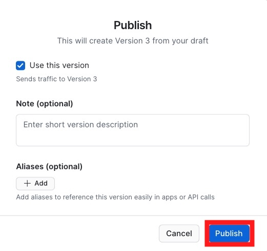

11. After publishing, click **"Add to Snowflake CoWork"** to make the agent available in the CoWork conversational interface


**Step 4b — Open CoWork and select the agent**

1. In Snowsight, click the **AI & ML** icon (brain icon) in the left sidebar

2. Select **CoWork** from the menu

3. Click **"New Chat"** (top left) to start a new conversation

4. In the agent selector dropdown, choose **RETAILIQ_CORTEX_AGENT**

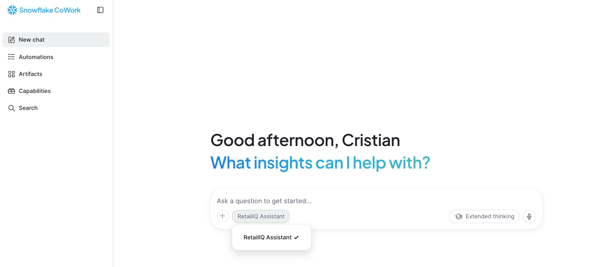

**Step 4c — Demo questions (run in this order to show progressive complexity)**

1. `"What is the revenue by region?"`
   → **Analyst only** — generates SQL, returns structured table

   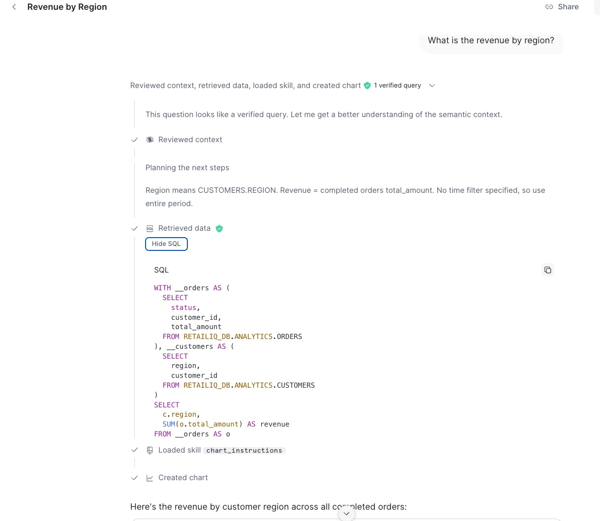

   > **Expand the thinking panel** (click on the "thinking" or tool-call section) to inspect what happens behind the scenes: which tool was selected, the generated SQL, and how the agent interpreted your prompt. This is key to validate the orchestration path and confirm the semantic view is being used correctly.

2. `"Top 5 product categories by number of orders"`
   → **Analyst only** — SQL aggregation with ranking

3. `"What do customers complain about regarding delivery?"`
   → **Search only** — semantic search over reviews, returns qualitative excerpts

4. `"Find support tickets about refund delays"`
   → **Search only** — searches tickets corpus for refund-related issues

5. `"Which region has the most complaints about delivery?"`
   → **Cross-tool reasoning** — Search for delivery complaints, Analyst for regional grouping, agent synthesizes both

6. `"Are there any support tickets about our top-selling product?"`
   → **Both tools** — Analyst identifies top product, Search finds related tickets

> **Note:** Avoid prompts like *"Summarize all reviews for electronics"* — these trigger `AI_AGG` over hundreds of rows and can take 3-5+ minutes. Keep prompts focused on specific questions rather than broad summarization requests.

> **Live demo moment:** Show the **reasoning trace** panel (expand the tool calls). You will see:
> - Which tool was selected and why
> - The exact query sent to each tool
> - How the agent synthesizes answers from multiple sources
> - This is the debugging and observability story for production deployments.

---

### Module 5 — Snowflake Managed MCP Server `[10 min]`

In your workspace, navigate to `WORKSHOP_RETAIL_IQ > 03_aws_setup` and open **`01_create_mcp_server.sql`** — but do not run all statements in a row. Here we need some edits.

First, you need your account locator. Click on the **bottom-left circle** in Snowsight → **Account** → **Account details** and copy the account locator value.

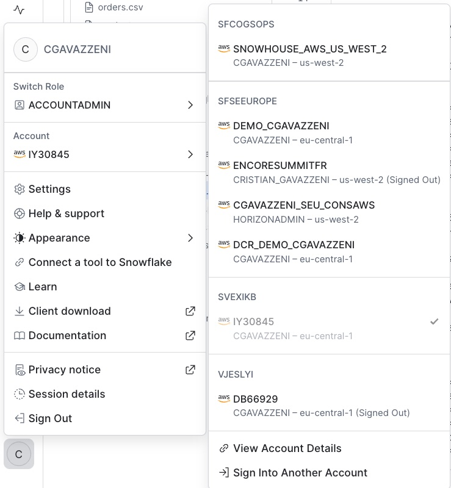

Then edit the script replacing `YOUR_ACCOUNT_LOCATOR` with the value you just copied. Now open the folder `03_aws_setup` in your workspace, open `01_create_mcp_server.sql` and run it line by line.

The MCP Server endpoint URL follows a fixed pattern — no need to run DESCRIBE:
```
https://<account_url>/api/v2/databases/RETAILIQ_DB/schemas/ANALYTICS/mcp-servers/RETAILIQ_MCP_SERVER_AGENT
```
Where `<account_url>` is your account hostname with underscores replaced by dashes (e.g. `sfseeurope-demo-cgavazzeni.snowflakecomputing.com`).

Also run the PAT Token creation section in the same script (`03_aws_setup/01_create_mcp_server.sql`):

```sql
-- Save this token — it's shown only once!
ALTER USER retailiq_user ADD PROGRAMMATIC ACCESS TOKEN retailiq_mcp_token 
  DAYS_TO_EXPIRY = 7 
  ROLE_RESTRICTION = 'RETAILIQ_ROLE';
```

**Create a user-level network policy** to allow external MCP access from AWS:

```sql
-- Required: bypasses the account-level VPN policy for the MCP service user
CREATE OR REPLACE NETWORK POLICY RETAILIQ_USER_POLICY
  ALLOWED_IP_LIST = ('0.0.0.0/0')
  COMMENT = 'Allow retailiq_user MCP access from any IP (workshop)';

ALTER USER retailiq_user SET NETWORK_POLICY = RETAILIQ_USER_POLICY;
```

> **Why?** Most Snowflake accounts have an account-level network policy that only allows corporate VPN IPs. The EC2 instance's IP won't be in that list. A user-level policy on `retailiq_user` overrides the account policy for that specific user only.

**What to save before the next module:**
```
MCP Endpoint URL:  https://YOUR_LOCATOR.snowflakecomputing.com/api/v2/databases/RETAILIQ_DB/schemas/ANALYTICS/mcp-servers/RETAILIQ_MCP_SERVER_AGENT
PAT Token:         <token value shown once>
Account Locator:   YOUR_LOCATOR (bottom-left in Snowsight → Account Details)
```

> **Important:** In the MCP endpoint URL, if your account locator contains an underscore (e.g. `DEMO_CGAVAZZENI`), replace it with a **dash** in the hostname (e.g. `demo-cgavazzeni.snowflakecomputing.com`). SSL certificates don't support underscores in hostnames.

**Key message:** The MCP endpoint is a standards-based interface. Any MCP client — Strands Agents, Claude Desktop, VS Code, your own app — can connect without any custom Snowflake SDK.

#### MCP Server Option B — Agent as a single tool

The MCP server we just created (`RETAILIQ_MCP_SERVER`) exposes **individual tools** (Analyst, Search Reviews, Search Tickets). This means the **external client** (e.g., Strands Agent) is responsible for orchestration — deciding which tools to call, in what order, and how to combine results.

There's an alternative approach: expose the **Cortex Agent itself** as a single MCP tool. In this case, **Snowflake handles all orchestration** internally (tool selection, multi-hop reasoning, response synthesis), and the external client simply sends a question and receives a complete answer.

| | Option A: Individual Tools | Option B: Agent as Tool |
|---|---|---|
| **MCP Server** | `RETAILIQ_MCP_SERVER` | `RETAILIQ_MCP_SERVER_AGENT` |
| **Tools exposed** | 3 (analyst + 2 search) | 1 (the cortex agent) |
| **Orchestration** | External (Strands Agent decides) | Internal (Snowflake Cortex Agent decides) |
| **Best for** | Full control on AWS side, custom routing logic | Simplicity, governed responses, single entry point |
| **Latency** | Multiple round-trips possible | Single call, Snowflake orchestrates internally |

For the next module (AWS integration), we'll use **Option B** — the agent-as-tool approach — because it keeps the AWS side simple and lets Snowflake handle all the intelligence.

Now open `03_aws_setup/01_create_mcp_server_agent.sql` in your workspace and run it:

```sql
-- Creates an MCP Server that wraps the entire Cortex Agent as a single tool
CREATE OR REPLACE MCP SERVER RETAILIQ_MCP_SERVER_AGENT ...
```

After running, verify it with:
```sql
SHOW MCP SERVERS IN SCHEMA RETAILIQ_DB.ANALYTICS;
```

---

### Module 6 — AWS Strands Agent Setup `[15 min]`

**Deploy the CloudFormation stack:**

1. **Download the CloudFormation template locally:**
   - If you have already cloned the repo: the file is at `03_aws_setup/agentcore_cfn.yaml`
   - Otherwise, download from GitHub: go to `https://github.com/sfc-gh-cgavazzeni/AWSTechSummit2026`, navigate to `WORKSHOP_RETAIL_IQ/03_aws_setup/agentcore_cfn.yaml`, click **Raw**, then save (Ctrl+S / Cmd+S)

2. Go to **AWS Console** → make sure you are in the **eu-central-1 (Frankfurt)** region → **CloudFormation** → **Create Stack** → "With new resources"

3. Select **"Upload a template file"** and upload the `agentcore_cfn.yaml` file

4. Fill in the 3 parameters:
   - `SnowflakeMCPEndpoint`: your MCP endpoint URL (see format above from Module 5)
   - `SnowflakePATToken`: the PAT token from Module 5
   - `SnowflakeAccountLocator`: your account locator (from Module 5)

   > **Note:** The stack is fully self-contained — it creates its own VPC, public subnet, Internet Gateway, and security group. No pre-existing networking required.

5. Acknowledge IAM creation and click **Submit**

**Wait ~5 minutes** for the stack to reach `CREATE_COMPLETE`.

6. Connect to the instance via **SSM Session Manager**:
   - Go to AWS Console → **EC2** → **Instances** → select the `RetailIQ-Workshop-...` instance
   - Click **Connect** → **Session Manager** tab → **Connect**

```bash
cd /opt/retailiq
ls -la  # verify files are present
python3.11 --version  # should be 3.11+
```

---

### Module 7 — Strands Agent End-to-End `[10 min]`

On the EC2 instance (connected via SSM Session Manager):

```bash
cd /opt/retailiq
python3.11 retailiq_agent.py
```

You'll see the welcome banner. Test with the sample questions from `help`:

```
> What are the top 5 product categories by revenue this quarter?
> What are customers saying about electronics?
> Which regions have the most delivery complaints, and how does their revenue compare?
```

**Watch the terminal output** — you'll see:

- Which tool was selected (Analyst vs Search)

- The query sent to each tool

- How the agent synthesizes the answer

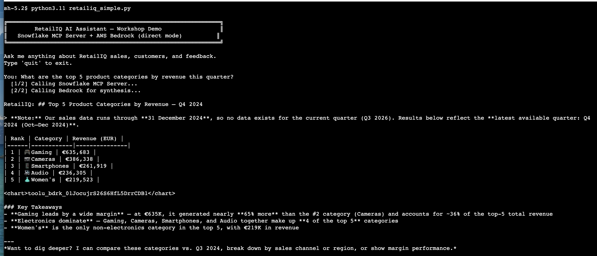

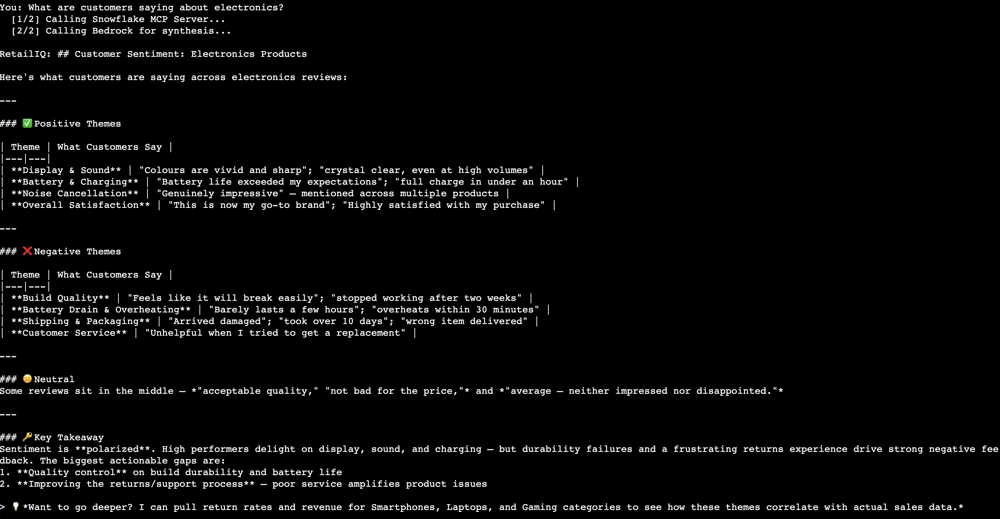

**Multi-turn demo** (shows Strands Agent multi-turn context):

```
> Analyze revenue by region for this year
[Agent returns regional breakdown]

> Focus on the bottom 3 regions — what are customers saying there?
[Agent remembers the regions from turn 1, searches reviews for those regions]

> What actions would you recommend for those regions?
[Agent synthesizes both data streams into recommendations]
```

---

### Module 8 — Production Patterns & Q&A `[10 min]`

**Production Architecture Decisions:**

| Decision | Development | Production |
|----------|------------|------------|
| Auth | PAT token, 7 days | PAT + Network Policy + IP allowlist |
| Role | RETAILIQ_ROLE | Least-privilege read-only role |
| Warehouse | XSmall | Auto-scaling cluster |
| MCP scope | All tools | Tool-level RBAC per team |
| Monitoring | Console logs | CloudWatch + Snowflake QUERY_HISTORY |

**Security pattern — lock down MCP to EC2 IPs only:**

```sql
-- After getting EC2 NAT Gateway / Elastic IP from AWS:
CREATE OR REPLACE NETWORK POLICY ec2_only
  ALLOWED_IP_LIST = ('X.X.X.X/32', 'Y.Y.Y.Y/32')  -- EC2 egress IPs
  COMMENT = 'Restrict MCP access to EC2 egress IPs only';

ALTER USER retailiq_user SET NETWORK_POLICY = ec2_only;
```

**Seed Q&A questions (for facilitators):**

- *"Can I use this with Bedrock Knowledge Bases instead of Cortex Search?"* → Yes, but you lose Snowflake governance and the hybrid search quality

- *"What's the latency like?"* → Typical: Analyst ~2-5s, Search ~1-2s, full agent turn ~5-12s

- *"Does Strands support streaming?"* → Yes, the Strands SDK supports streaming responses

- *"Can multiple teams share the same MCP server?"* → Yes, tool-level access is controlled by role grants

- *"Is there a cost calculator?"* → Show Cortex token pricing + Bedrock model pricing

---

## Cleanup

Run `01_snowflake_setup/07_cleanup.sql` to remove all Snowflake objects.

In AWS: delete the CloudFormation stack (`retailiq-workshop`).

---

## Resources

- [Snowflake Cortex Agents docs](https://docs.snowflake.com/en/user-guide/snowflake-cortex/cortex-agents)

- [Snowflake Managed MCP Server](https://docs.snowflake.com/en/user-guide/snowflake-cortex/cortex-agents-mcp)

- [Cortex Analyst & Semantic Views](https://docs.snowflake.com/en/user-guide/snowflake-cortex/cortex-analyst)

- [Cortex Search](https://docs.snowflake.com/en/user-guide/snowflake-cortex/cortex-search/cortex-search-overview)

- [Amazon Bedrock](https://aws.amazon.com/bedrock/)

- [Strands Agents SDK](https://strandsagents.com)

- [AWS + Snowflake Reference Architecture](https://catalog.us-east-1.prod.workshops.aws/workshops/2d4e5ea4-78c8-496f-8246-50d8971414c9)
