# Enterprise AI Agents: Snowflake Cortex × AWS Bedrock AgentCore
## Hands-On Workshop — AWS Tech Summit 2026

**Duration:** 2 hours | **Audience:** AWS Solution Architects | **Format:** Pair labs

---

## What You'll Build

By the end of this workshop, you will have deployed a production-style AI agent that:

1. Answers **quantitative business questions** ("What is revenue by region this quarter?") by generating and executing SQL against a Snowflake **Semantic View** via **Cortex Analyst**

2. Answers **qualitative questions** ("What are customers saying about delivery?") via **Cortex Search** over unstructured review and ticket data

3. Orchestrates both capabilities through the **Snowflake Managed MCP Server**, exposed to **AWS Bedrock AgentCore** as a fully managed, multi-turn conversational agent

```
┌─────────────────────────────────────────────────────┐
│              AWS Bedrock AgentCore                  │
│   ┌──────────────────┐  ┌─────────────────────────┐ │
│   │  Strands Agent   │  │  AgentCore Memory       │ │
│   │  (Claude 3.5)    │◄─│  (multi-turn context)   │ │
│   └────────┬─────────┘  └─────────────────────────┘ │
└────────────┼────────────────────────────────────────┘
             │  MCP over HTTPS + PAT Auth
┌────────────▼────────────────────────────────────────┐
│         Snowflake Managed MCP Server                │
│  ┌─────────────────┐  ┌────────────────────────┐    │
│  │  Cortex Analyst │  │  Cortex Search         │    │
│  │  (Semantic View)│  │  (reviews + tickets)   │    │
│  └─────────────────┘  └────────────────────────┘    │
└─────────────────────────────────────────────────────┘
```

---

## Scenario: RetailIQ

RetailIQ is an Italian multi-channel retailer with 50 stores across Italy plus an online shop. The data covers:

- **50,000 orders** across 3 years (2022–2024)

- **5,000 customers** with loyalty tiers and regional data

- **200 products** across 5 categories

- **50 stores** across Italian regions

- **15,000 customer reviews** (for Cortex Search)

- **8,000 support tickets** (for Cortex Search)

---

## Prerequisites

**Snowflake:**

- A Snowflake account with Cortex features enabled (Cortex Search, Cortex Analyst, MCP Server)

- ACCOUNTADMIN access (or an admin who can run `01_setup_environment.sql`)

**AWS:**

- AWS account with access to Amazon Bedrock

- A Claude Sonnet model subscribed in AWS Marketplace

- IAM permissions to deploy CloudFormation stacks and create Secrets Manager secrets

**Local (facilitator only):**

- Python 3.9+ with pandas, numpy, faker (`pip install pandas numpy faker`)

- To generate the dataset: `python 00_data/generate_data.py`

---

## Workshop Modules

| Module | Topic | Time | File |
|--------|-------|------|------|
| 0 | Architecture overview & setup | 15 min | `01_snowflake_setup/01_setup_environment.sql` |
| 1 | Load data & explore the schema | 10 min | `01_snowflake_setup/02_create_tables.sql` + `03_load_data.sql` |
| 2 | Build & tune a Semantic View | 25 min | `02_semantic_view/retailiq_semantic_view.yaml` |
| 3 | Cortex Search services | 10 min | `01_snowflake_setup/04_create_search_service.sql` |
| 4 | Cortex Agent (native, in CoWork) | 15 min | `01_snowflake_setup/05_create_cortex_agent.sql` |
| 5 | MCP Server + PAT Token | 10 min | `01_snowflake_setup/06_create_mcp_server.sql` |
| 6 | AWS Bedrock AgentCore setup | 15 min | `03_aws_setup/agentcore_cfn.yaml` |
| 7 | Strands agent — end-to-end | 10 min | `03_aws_setup/retailiq_agent.py` |
| 8 | Multi-turn demo + production patterns | 10 min | — |

---

## Step-by-Step Instructions

### Getting Started — Create a Workspace from the Workshop GitHub Repo

**What is a Snowflake Workspace?**

A Workspace is a collaborative coding environment inside Snowsight where you can work with SQL files, notebooks, Streamlit apps, and dbt projects — all versioned and organized in folders. Workspaces can be connected to a Git repository, which means all the workshop files will be automatically available inside Snowflake without any manual uploads.

For this workshop, we'll create a **Git Workspace** linked to the public GitHub repo containing all the SQL scripts, data, and configuration files.

**Step 1 — Open the Projects menu**

1. In Snowsight, click **Projects** in the left navigation sidebar

2. At the top, make sure you are on the **Workspaces** tab

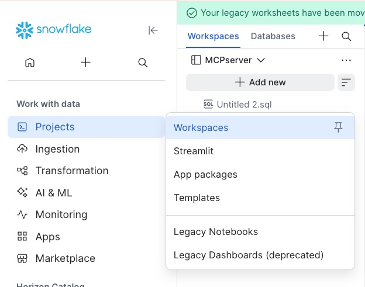

**Step 2 — Create a new Git Workspace**

1. Click the **"+"** button next to the search icon in the top toolbar

2. In the dropdown, under **"Create new"**, select **"Git workspace"**

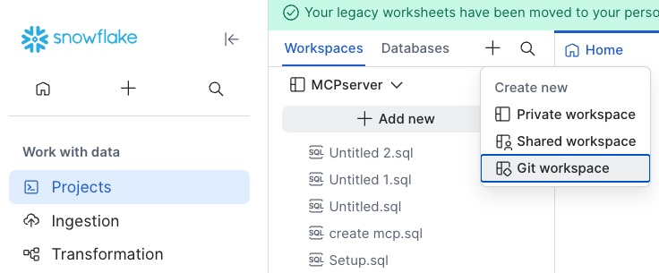

**Step 3 — Configure the Git repository connection**

In the "Create workspace from Git repository" dialog:

- **Repository URL**: enter `https://github.com/sfc-gh-cgavazzeni/AWSTechSummit2026/`

- **Workspace name**: enter `AWSTechSummit2026` (or any name you prefer)

- **API integration**: select your existing Git API integration (or click **"+ API Integration"** to create one)

- **Authentication**: select **"Public repository"** (no authentication needed — the repo is public)

- Click **"Create"**

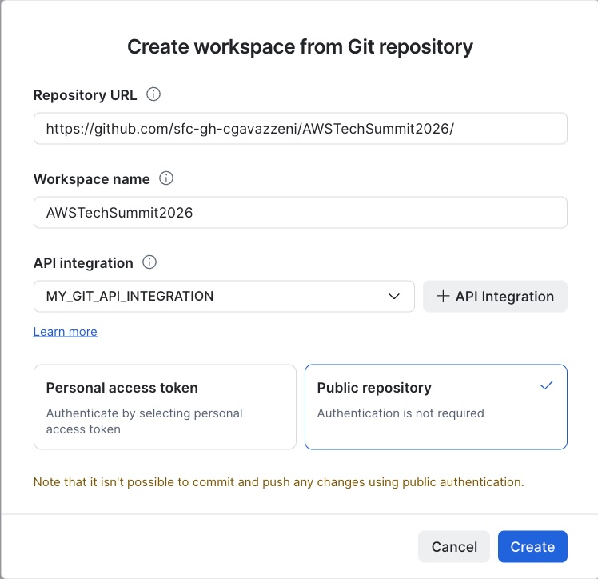

> **Note:** Since we use "Public repository" authentication, the workspace is read-only (you can't push changes back). This is fine for the workshop — you'll run SQL files directly from the workspace.

**Step 4 — Explore the workspace**

After creation, you'll see the full workshop file tree in the left panel:

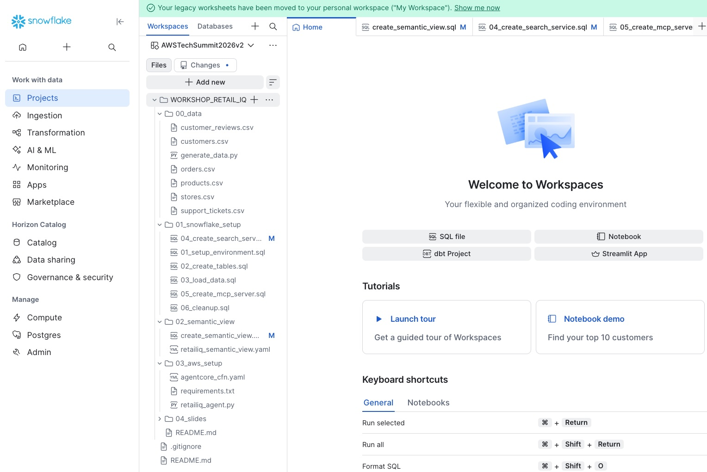

You can now open any SQL file directly from the workspace (it opens as a SQL worksheet), run it, and navigate between files. All workshop modules are organized in numbered folders:

- `00_data/` — synthetic dataset and generator

- `01_snowflake_setup/` — all SQL scripts (modules 0–5 + cleanup)

- `02_semantic_view/` — Semantic View DDL

- `03_aws_setup/` — CloudFormation + Strands agent

- `04_slides/` — presentation deck

---

### Module 0 — Environment Setup `[15 min]`

> Run as **ACCOUNTADMIN**

Open `01_snowflake_setup/01_setup_environment.sql` in a Snowflake SQL worksheet and run it top to bottom.

This creates:

- Role `RETAILIQ_ROLE` and user `retailiq_user`

- Warehouse `RETAILIQ_WH` (XSmall, auto-suspend 60s)

- Database `RETAILIQ_DB` and schema `ANALYTICS`

- Stage `RETAILIQ_STG` for data loading

> **Presenter tip:** While this runs, explain the Snowflake object hierarchy to the audience.

**Step — Download CSV files locally**

> **Note:** If you have already cloned the Git repository to your local laptop, you already have the CSV files in the `00_data/` folder and can skip this download step.

Before uploading data to the stage, you need to download all CSV files from the workspace to your local laptop. This is the easiest code-free way to get data into Snowflake.

In the workspace file tree (left panel), expand the `00_data` folder. For each CSV file, click the **⋯** (three dots) menu next to the file name and select **Download**:

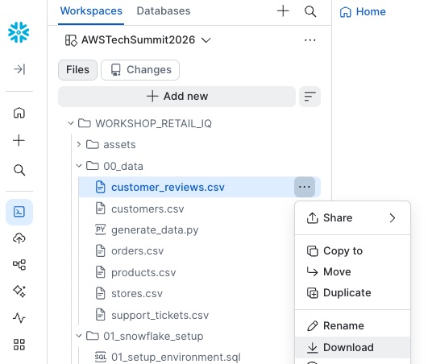

Download all 6 CSV files:
- `customers.csv`
- `customer_reviews.csv`
- `orders.csv`
- `products.csv`
- `stores.csv`
- `support_tickets.csv`

Save them to a known folder on your laptop (e.g., `Downloads/retailiq_data/`). You will upload them to the Snowflake stage in the next module.

---

### Module 1 — Load Data `[10 min]`

**Step 1:** Upload the CSV files to the Snowflake stage.

1. In the left sidebar, click **Catalog** → select **Explorer** from the dropdown menu:

   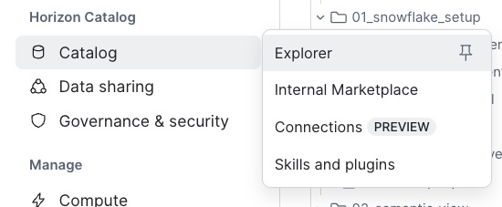

2. In the Explorer tree, navigate to **RETAILIQ_DB → ANALYTICS → Stages** and click on **RETAILIQ_STG**:

   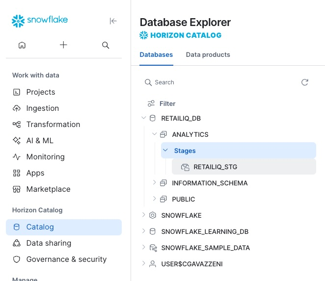

3. Click the **+ Files** button (top-right of the stage view). The **Upload Your Files** dialog appears. Verify that Schema is set to `RETAILIQ_DB.ANALYTICS` and Stage is `RETAILIQ_STG`. Drag and drop all 6 CSV files (or click **Browse** to select them), then click **Upload**:

   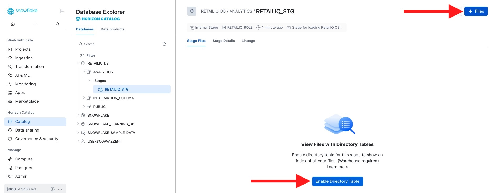

Upload these files from the `00_data/` folder:

- `orders.csv`

- `products.csv`

- `customers.csv`

- `stores.csv`

- `customer_reviews.csv`

- `support_tickets.csv`

**Step 2:** Run `01_snowflake_setup/02_create_tables.sql` to create tables.

**Step 3:** Run `01_snowflake_setup/03_load_data.sql` to load data.

Expected row counts after loading:
```
orders:           ~50,000
products:            ~200
customers:         ~5,000
stores:               ~50
customer_reviews: ~15,000
support_tickets:   ~8,000
```

> **Discussion point:** Ask participants to query the raw data and try to answer "What is revenue by region this year?" manually. They'll write 15+ lines of SQL. This motivates the Semantic View.

---

### Module 2 — Semantic View: Build & Tune `[25 min]`

> The most important module. Take your time here.

#### What is a Semantic View?

A Semantic View is a **business vocabulary layer** that sits between your raw tables and Cortex Analyst. It defines:

- How tables **join** to each other

- What **dimensions** and **metrics** mean in business terms

- **Synonyms** so the AI understands "revenue", "fatturato", "sales" all mean the same thing

- **Verified Queries** — pre-validated SQL for your most important KPIs

**The key insight for SA architects:** *A Semantic View gives you full control over the vocabulary and logic the AI uses. The difference between a bare auto-generated SV and a tuned one with verified queries is the difference between a demo and a production deployment.*

#### Step 2a — Build a Basic Semantic View with Cortex Code (10 min)

Cortex Analyst always requires a Semantic View — there's no "zero SV" mode. But rather than hand-writing YAML from scratch, we'll use **Cortex Code** (CoCo) and its **semantic-view skill** to scaffold a first version automatically from the schema.

**Open Cortex Code** (CoCo Desktop or the browser IDE) connected to the `RETAILIQ_DB.ANALYTICS` schema.

In the CoCo chat, type the following prompt:

```
Create a semantic view called RETAILIQ_SV_BASIC for the tables
RETAILIQ_DB.ANALYTICS.ORDERS, RETAILIQ_DB.ANALYTICS.PRODUCTS,
RETAILIQ_DB.ANALYTICS.CUSTOMERS, and RETAILIQ_DB.ANALYTICS.STORES.

Keep it simple: just define the tables, detect the join relationships,
and add basic column descriptions. No verified queries, no custom metrics,
no synonyms — just the foundation.
```

> **What happens:** CoCo invokes the `semantic-view` skill which reads the table schemas via `DESCRIBE TABLE`, infers join relationships (via matching column names like `product_id`, `customer_id`, `store_id`), generates column descriptions from the column names, and produces a complete YAML file. It will also deploy the SV to Snowflake.

**Watch CoCo work** — it will:

1. Inspect all 4 table schemas

2. Detect 3 join paths (orders→products, orders→customers, orders→stores)

3. Generate column-level descriptions

4. Create and deploy the Semantic View

**Now test the basic SV in Cortex Analyst Playground:**

1. In Snowsight, click the **AI & ML** icon (brain icon) in the left navigation sidebar

2. Select **Cortex Analyst** from the menu

3. You'll see a list of available Semantic Views — click on **RETAILIQ_SV_BASIC** (the one CoCo just created)

4. Click the **Playground** tab at the top to open the interactive chat interface

5. In the chat box at the bottom, type and send:

> "What is the revenue by region for this year?"

Observe the gap: the basic SV has no concept of "revenue" as a metric (it doesn't know to filter `status='Completed'`), "region" is ambiguous (customer region? store region?), and there are no synonyms or verified queries. The generated SQL may be wrong or imprecise.

> **Talking point for SAs:** *CoCo got us from zero to a working Semantic View in 30 seconds — no YAML authoring, no documentation lookup. But a basic auto-scaffolded SV is like auto-generated API docs: technically correct but not useful for production. The real value comes from tuning. However, if you provide CoCo with richer context — for example, an Excel file describing your data model with metric definitions, join keys, synonyms, and business descriptions — you can get a production-quality Semantic View even on the first shot. What really makes the difference is the context you provide.*

#### Step 2a-bis — Understand How Cortex Analyst Processes a Question (5 min)

Now that we have a basic SV, let's use it to understand **how Analyst works under the hood**. In the Playground, ask a question that the basic SV can handle reasonably well:

> "What is the total revenue by channel year to date?"

When Analyst returns the answer, click on the **SQL** panel to expand it. You'll see two distinct query representations:

**1. Logical Query** — This is the *semantic-level* plan that Analyst generates first. It describes WHAT to compute using the vocabulary defined in your Semantic View (metric names, dimension names, filters). Think of it as the "intent" expressed in business terms:

- Which metric to compute (e.g., `total_amount`)

- Which dimension to group by (e.g., `channel`)

- Which filters to apply (e.g., time range)

**2. Physical Query** — This is the actual executable Snowflake SQL that gets run against your warehouse. It translates the logical plan into concrete JOINs, column references, and WHERE clauses. This is what you'd have to write manually without Analyst.

> **Why this matters for SAs:** The logical/physical split is what makes Analyst production-safe. The LLM only generates the logical plan (constrained by the Semantic View vocabulary). The physical query is deterministically derived from the SV definition — no hallucinated table names, no invented columns. This is a fundamentally different architecture from "just ask GPT to write SQL".

**3. The "+ Verified Query" button** — Notice the **+ Verified Query** button (or similar "Save as VQ" action) that appears alongside the generated SQL. This is the fast path for tuning: if the generated SQL is correct, you can save it directly as a Verified Query so that next time this question (or a similar one) is asked, Analyst uses your validated SQL as-is. This is the iterative tuning loop:

1. Ask a question → Analyst generates SQL

2. Verify the SQL is correct

3. Click "+ Verified Query" to lock it in

4. Next time, Analyst matches the question pattern and reuses the exact validated SQL

**4. Response metadata** — Expand the response metadata panel (click the info icon or "Details" in the response). This shows a JSON object like:

```json
{
  "question_category": "CLEAR_SQL",
  "analyst_orchestration_path": "regular_sqlgen",
  "cortex_search_retrieval": [],
  "analyst_latency_ms": 4284,
  "model_names": ["claude-sonnet-4-6"],
  "is_semantic_sql": false
}
```

Key fields to highlight:

- **question_category** — How Analyst classified the question (e.g., `CLEAR_SQL` means it was clear enough to generate SQL directly)

- **analyst_orchestration_path** — The internal routing used (`regular_sqlgen` = standard SQL generation, vs. VQ match when a Verified Query is used)

- **model_names** — Which LLM model was used for generation

- **analyst_latency_ms** — End-to-end latency in milliseconds (useful for performance monitoring)

- **cortex_search_retrieval** — Whether any Cortex Search services were invoked (empty array = none)

- **is_semantic_sql** — Whether the SQL was generated using the semantic layer

> **Purpose of metadata for production teams:** Response metadata enables monitoring and observability in production deployments. You can track: (a) which orchestration path is being used (VQ match vs. regular SQL generation), (b) which questions are classified as unclear and need VQs, (c) latency per question for SLA monitoring, (d) which models are being used. This is how you build a tuning roadmap — focus VQ effort on the highest-volume questions that take the `regular_sqlgen` path.

#### Step 2b — Deploy the Tuned Semantic View via SQL (10 min)

Now let's replace the basic SV with the hand-crafted one that has metrics, synonyms, and verified queries.

1. Go back to your **Workspace** in Snowsight (click the workspace icon in the left sidebar)

2. Open a **new SQL Worksheet** — name it `Creating a Semantic View`

3. Import the file `02_semantic_view/create_semantic_view.sql` from the workshop repo (or copy-paste its contents into the worksheet)

4. Run the entire worksheet — it executes a single `CREATE OR REPLACE SEMANTIC VIEW` DDL statement that defines all tables, relationships, dimensions, facts, metrics, custom instructions, and verified queries in one go.

> While it runs, walk through the DDL structure with the audience. Highlight what the basic CoCo-generated SV was missing: **metric definitions** (like `total_revenue = SUM(...) WHERE status='Completed'`), **synonyms** (Italian + English), **IS_ENUM** with sample_values, **AI_SQL_GENERATION** custom instructions, and **AI_VERIFIED_QUERIES**.

5. Verify the SV was created:

```sql
SHOW SEMANTIC VIEWS LIKE 'RETAILIQ_SV' IN SCHEMA RETAILIQ_DB.ANALYTICS;
```

#### Step 2c — Test with the Tuned Semantic View (5 min)

Ask the same question again with `RETAILIQ_SV` (the tuned one). Compare:

- The SQL now correctly uses `SUM(total_amount) WHERE status='Completed'`

- "Region" resolves unambiguously to `customers.region`

- Synonyms mean "fatturato", "revenue", "sales" all work

#### Step 2d — Tune Further: Add a Verified Query (5 min)

In the Analyst UI, click on the Semantic View and add a new Verified Query:

- Question: "What is our return rate by product category?"

- Use the SQL from `retailiq_semantic_view.yaml` as a reference

- Save and re-test — the VQ guarantees the exact SQL you validated

**Takeaway:** Verified Queries are the single most impactful tuning mechanism. They guarantee correct SQL for your most important business questions. Start with auto-generate to get a baseline, then iteratively add metrics, synonyms, and VQs.

---

### Module 3 — Cortex Search `[10 min]`

#### What is Cortex Search?

Cortex Search is Snowflake's fully managed search service that combines **full-text search** (BM25) with **vector/semantic search** (embeddings) in a single hybrid retrieval engine — no external infrastructure required.

**Key benefits compared to traditional RAG pipelines:**

| Traditional RAG | Cortex Search |
|---|---|
| You manage embedding model, vector DB (Pinecone, Weaviate, etc.), chunking logic, sync pipelines | Snowflake manages everything — one DDL statement |
| Data leaves Snowflake → copied to external vector store | Data stays in Snowflake — no data movement, no security gaps |
| You maintain sync between source tables and vector index | Auto-refreshes from source table (TARGET_LAG) — always up to date |
| You implement hybrid search (keyword + semantic) yourself | Built-in hybrid retrieval combining BM25 + embedding similarity |
| Separate cost for embedding API calls + vector DB hosting | Included in Snowflake serverless compute — pay per query |

**Where does embedding happen?** Snowflake automatically generates and stores embeddings internally when you create the search service. You never see or manage the vectors — Cortex Search handles tokenization, embedding, indexing, and retrieval entirely within the Snowflake security perimeter.

**Where is the vector database?** There is no external vector database. Snowflake stores the vector index as an internal optimized structure, co-located with your data. This means: governance (RBAC, masking) applies to search results, no data exfiltration risk, and zero operational overhead.

> **Talking point for SAs:** Cortex Search eliminates the entire retrieval infrastructure stack. One SQL statement replaces: embedding model deployment, vector store provisioning, data sync pipelines, and hybrid search orchestration.

---

Run `01_snowflake_setup/04_create_search_service.sql`.

This creates two search services:

- `RETAILIQ_REVIEWS_SEARCH` — over customer review text

- `RETAILIQ_TICKETS_SEARCH` — over support ticket text

**Test the search services:**

Open a new SQL worksheet and run these queries to see semantic matching in action:

```sql
-- Semantic search on reviews: finds results about delivery issues
-- even if the exact word "delivery" doesn't appear in the text
SELECT *
FROM TABLE(
  SNOWFLAKE.CORTEX.SEARCH_PREVIEW(
    'RETAILIQ_DB.ANALYTICS.RETAILIQ_REVIEWS_SEARCH',
    '{
      "query": "delivery problems in southern Italy",
      "columns": ["review_text", "product_name", "rating"],
      "limit": 5
    }'
  )
);

-- Semantic search on tickets: finds billing/refund issues
-- without needing exact keyword matches
SELECT *
FROM TABLE(
  SNOWFLAKE.CORTEX.SEARCH_PREVIEW(
    'RETAILIQ_DB.ANALYTICS.RETAILIQ_TICKETS_SEARCH',
    '{
      "query": "refund not processed",
      "columns": ["ticket_text", "category", "status"],
      "limit": 5
    }'
  )
);
```

Notice how the results match **semantically** — for example, "delivery problems" finds reviews mentioning slow shipping, lost packages, or courier issues in Sicily/Naples, even if the exact phrase "delivery problems" never appears. This is the power of hybrid search (BM25 + vector embeddings) vs. pure keyword matching.

**Key message for SA architects:** Cortex Search is a **hybrid search** (full-text + vector embedding) with no infrastructure to manage. Zero vector database to deploy, zero embedding pipeline to maintain.

---

### Module 4 — Create Cortex Agent & Test in CoWork `[15 min]`

Now that we have both Cortex Analyst (Semantic View) and Cortex Search (2 services), we'll combine them into a single **Cortex Agent** that can reason across structured and unstructured data.

**Step 4a — Create the Cortex Agent from Snowsight UI**

1. In Snowsight, click the **AI & ML** icon (brain icon) in the left sidebar

2. Select **Cortex Agents** from the menu

   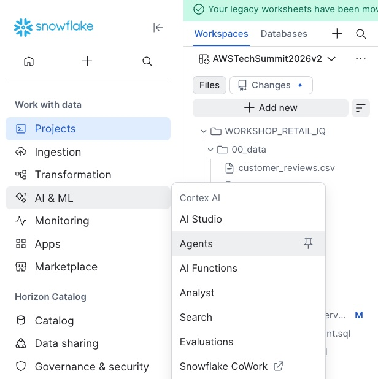

3. Click **"+ Create Agent"** (top-right) to create a new agent

4. In the "Create agent" dialog:
   - **Database and schema**: select `RETAILIQ_DB` → `ANALYTICS`
   - **Agent object name**: enter `RETAILIQ_CORTEX_AGENT`
   - **Display name**: enter `RetailIQ Assistant`
   - Click **"Create agent"**

   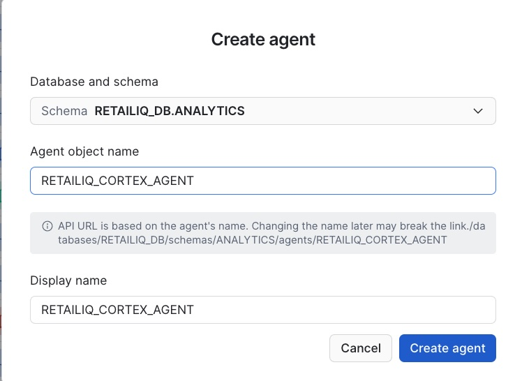

5. You are now in the agent **Configuration** page. Click the **Tools** tab (under General | Instructions | **Tools** | Skills | MCP)

   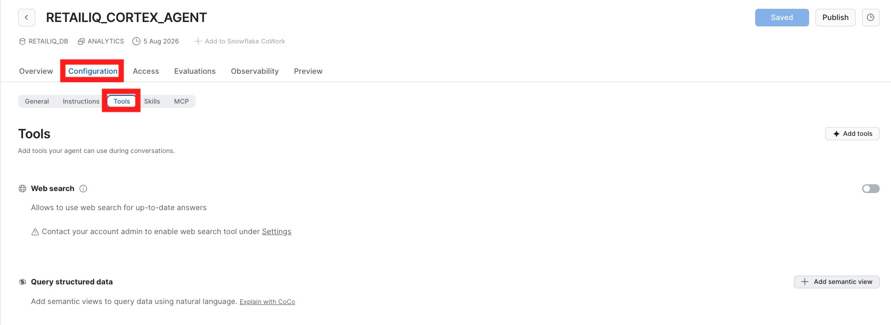

6. In the Tools panel, add the following:

   **Query structured data** — click **"+ Add semantic view"**:
   - Schema: select `RETAILIQ_DB.ANALYTICS`
   - Semantic View: select `RETAILIQ_SV`
   - Name: `RetailIQ_Analyst`
   - Description: `Structured analytics tool for RetailIQ sales, orders, customers and stores data. Use for quantitative questions about revenue, conversion rates, order volumes, customer segments, regional performance, product categories, and time-series trends.`
   - Warehouse: leave as "User's default"
   - Query timeout: leave as `600`
   - Click **"Add"**

   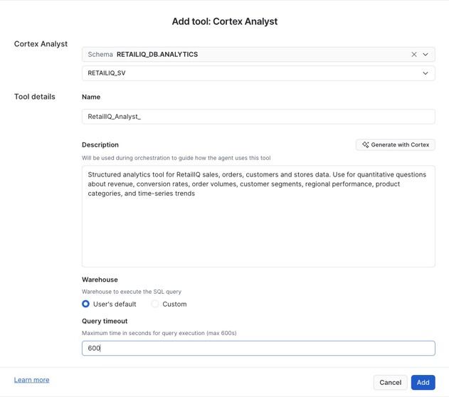

   **Search documents and unstructured data** — click **"+ Add search service"** twice:
   - First service:
     - Database: select `RETAILIQ_DB.ANALYTICS`
     - Search service: select `RETAILIQ_DB.ANALYTICS.RETAILIQ_REVIEWS_SEARCH`
     - Name: `SEARCHREVIEWS`
     - Description: `Semantic search over customer reviews. Use for qualitative insights, sentiment analysis, product feedback, and understanding what customers say about their experiences.`
     - Advanced configuration:
       - Max results: `4`
       - Target results: *(leave empty)*
       - ID column: select `REVIEW_ID`
       - Title column: select `PRODUCT_NAME`
     - Click **"Add"**

   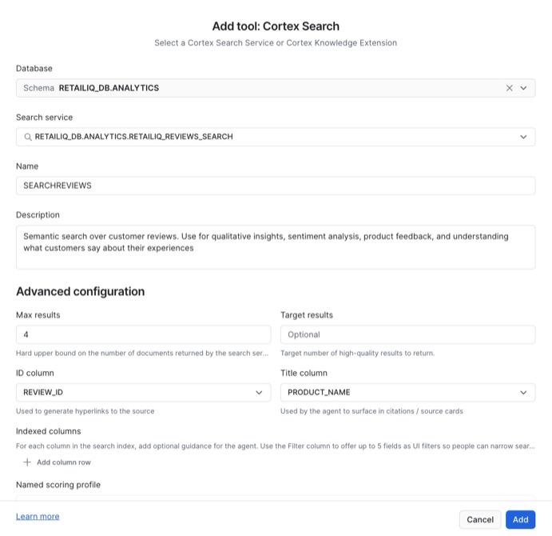

   - Second service:
     - Database: select `RETAILIQ_DB.ANALYTICS`
     - Search service: select `RETAILIQ_DB.ANALYTICS.RETAILIQ_TICKETS_SEARCH`
     - Name: `SEARCHTICKETS`
     - Description: `Semantic search over support tickets. Use for understanding common issues, complaints, return reasons, and service quality feedback.`
     - Advanced configuration:
       - Max results: `4`
       - Target results: *(leave empty)*
       - ID column: select `TICKET_ID`
       - Title column: select `CATEGORY`
     - Click **"Add"**

   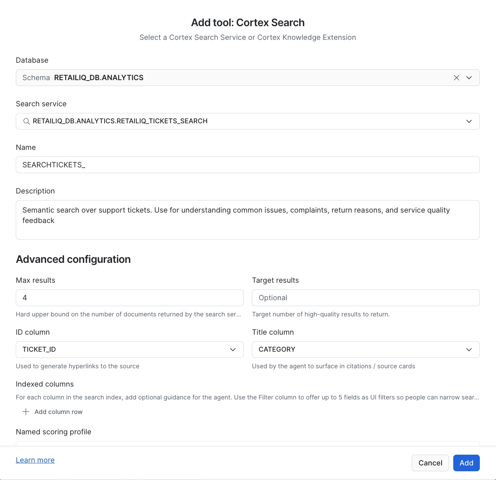

   *(Leave Web search OFF, Code Execution tool ON by default)*

7. Click the **General** tab and set the **Query Warehouse** to `RETAILIQ_WH`

8. Click **"Save"** to save the agent configuration

> **Talking point:** Notice how tool descriptions are critical — they guide the agent's reasoning about WHICH tool to call for each question. Good descriptions = accurate tool selection.

**Step 4b — Open CoWork and select the agent**

1. In Snowsight, click the **AI & ML** icon (brain icon) in the left sidebar

2. Select **CoWork** from the menu

3. Click **"New Session"** (or the `+` button) to start a new conversation

4. In the agent selector dropdown, choose **RETAILIQ_CORTEX_AGENT**

**Step 4c — Demo questions (run in this order to show progressive complexity)**

1. `"What are our top 5 categories by revenue this quarter?"`
   → **Analyst only** — generates SQL, returns structured table

2. `"What do customers say about our electronics products?"`
   → **Search only** — semantic search over reviews, returns qualitative excerpts

3. `"Which product categories have the highest return rates, and what are customers saying about those returns?"`
   → **Both tools** — the agent reasons: first Analyst for return rate data, then Search for customer verbatims about those categories

4. `"Compare revenue performance by region — and are there regions with more delivery complaints?"`
   → **Cross-tool reasoning** — Analyst for regional revenue, Search for complaint patterns, agent synthesizes both

> **Live demo moment:** Show the **reasoning trace** panel (expand the tool calls). SAs will see:
> - Which tool was selected and why
> - The exact query sent to each tool
> - How the agent synthesizes answers from multiple sources
> - This is the debugging and observability story for production deployments.

---

### Module 5 — Snowflake Managed MCP Server `[10 min]`

Run `01_snowflake_setup/06_create_mcp_server.sql`.

```sql
DESCRIBE MCP SERVER RETAILIQ_MCP_SERVER;
-- Copy the endpoint URL from the result — you'll need it for AWS
```

Also run the PAT Token creation from `01_snowflake_setup/01_setup_environment.sql` (the section at the bottom).

```sql
-- Save this token — it's shown only once!
ALTER USER retailiq_user ADD PROGRAMMATIC ACCESS TOKEN retailiq_mcp_token 
  DAYS_TO_EXPIRY = 7 
  ROLE_RESTRICTION = 'RETAILIQ_ROLE';
```

**What to save before the next module:**
```
MCP Endpoint URL:  https://YOUR_LOCATOR.snowflakecomputing.com/mcp/...
PAT Token:         <token value shown once>
Account Locator:   YOUR_LOCATOR (bottom-left in Snowsight → Account Details)
```

**Key message:** The MCP endpoint is a standards-based interface. Any MCP client — Bedrock AgentCore, Claude Desktop, VS Code, your own app — can connect without any custom Snowflake SDK.

---

### Module 6 — AWS Bedrock AgentCore Setup `[15 min]`

**Deploy the CloudFormation stack:**

1. Go to AWS Console → CloudFormation → Create Stack

2. Upload `03_aws_setup/agentcore_cfn.yaml`

3. Fill in parameters:
   - `SnowflakeMCPEndpoint`: the URL from Module 5
   - `SnowflakePATToken`: the PAT token from Module 5
   - `SnowflakeAccountLocator`: your account locator
   - `KeyPairName`: an existing EC2 key pair
   - `SubnetId` / `VpcId`: a public subnet in any VPC

4. Acknowledge IAM creation and click Submit

**Wait ~5 minutes** for the stack to complete.

5. Go to Outputs → `Ec2ConnectionURL` → click to open AWS CloudShell or use EC2 Instance Connect

```bash
cd /opt/retailiq
ls -la  # verify files are present
python3 --version  # should be 3.11+
```

---

### Module 7 — Strands Agent End-to-End `[10 min]`

On the EC2 instance:

```bash
# The credentials are already injected from Secrets Manager
# Just run the agent
python3 retailiq_agent.py
```

You'll see the welcome banner. Test with the sample questions from `help`:

```
> What are the top 5 product categories by revenue this quarter?
> What are customers saying about electronics?
> Which regions have the most delivery complaints, and how does their revenue compare?
```

**Watch the terminal output** — you'll see:

- Which tool was selected (Analyst vs Search)

- The query sent to each tool

- How the agent synthesizes the answer

**Multi-turn demo** (shows AgentCore Memory value):

```
> Analyze revenue by region for this year
[Agent returns regional breakdown]

> Focus on the bottom 3 regions — what are customers saying there?
[Agent remembers the regions from turn 1, searches reviews for those regions]

> What actions would you recommend for those regions?
[Agent synthesizes both data streams into recommendations]
```

---

### Module 8 — Production Patterns & Q&A `[10 min]`

**Production Architecture Decisions:**

| Decision | Development | Production |
|----------|------------|------------|
| Auth | PAT token, 7 days | PAT + Network Policy + IP allowlist |
| Role | RETAILIQ_ROLE | Least-privilege read-only role |
| Warehouse | XSmall | Auto-scaling cluster |
| MCP scope | All tools | Tool-level RBAC per team |
| Monitoring | Console logs | AgentCore traces + Snowflake QUERY_HISTORY |

**Security pattern — lock down MCP to AgentCore IPs only:**

```sql
-- After getting AgentCore NAT Gateway IPs from AWS:
CREATE OR REPLACE NETWORK POLICY agentcore_only
  ALLOWED_IP_LIST = ('X.X.X.X/32', 'Y.Y.Y.Y/32')  -- AgentCore NAT IPs
  COMMENT = 'Restrict MCP access to AgentCore egress IPs only';

ALTER USER retailiq_user SET NETWORK_POLICY = agentcore_only;
```

**Seed Q&A questions (for facilitators):**

- *"Can I use this with Bedrock Knowledge Bases instead of Cortex Search?"* → Yes, but you lose Snowflake governance and the hybrid search quality

- *"What's the latency like?"* → Typical: Analyst ~2-5s, Search ~1-2s, full agent turn ~5-12s

- *"Does AgentCore support streaming?"* → Yes, the Strands SDK supports streaming responses

- *"Can multiple teams share the same MCP server?"* → Yes, tool-level access is controlled by role grants

- *"Is there a cost calculator?"* → Show Cortex token pricing + AgentCore runtime pricing

---

## Cleanup

Run `01_snowflake_setup/07_cleanup.sql` to remove all Snowflake objects.

In AWS: delete the CloudFormation stack (`agentcore-retailiq-workshop`).

---

## Resources

- [Snowflake Cortex Agents docs](https://docs.snowflake.com/en/user-guide/snowflake-cortex/cortex-agents)

- [Snowflake Managed MCP Server](https://docs.snowflake.com/en/user-guide/snowflake-cortex/cortex-agents-mcp)

- [Cortex Analyst & Semantic Views](https://docs.snowflake.com/en/user-guide/snowflake-cortex/cortex-analyst)

- [Cortex Search](https://docs.snowflake.com/en/user-guide/snowflake-cortex/cortex-search/cortex-search-overview)

- [Amazon Bedrock AgentCore](https://aws.amazon.com/bedrock/agentcore/)

- [Strands Agents SDK](https://strandsagents.com)

- [AWS + Snowflake Reference Architecture](https://catalog.us-east-1.prod.workshops.aws/workshops/2d4e5ea4-78c8-496f-8246-50d8971414c9)
